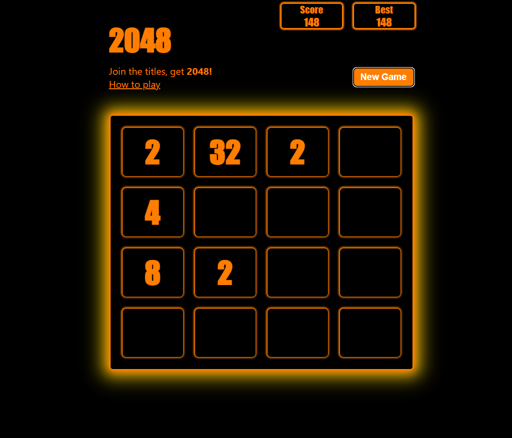

# 2048 Game 🎮



Welcome to the 2048 Game! This is a JavaScript implementation of the classic 2048 puzzle game, where you combine tiles to reach the elusive 2048 tile.

## Features ✨
- Play the classic 2048 game in your browser.
- Use arrow keys to move tiles on the grid.
- Combine tiles with the same number to create higher-valued tiles.
- Track your current and best scores.
- Simple and intuitive UI.

## Installation 🛠️
To play this game locally, follow these steps:

1. Clone the repository:
    ```bash
    git clone https://github.com/LuthoYRN/2048-game.git
    ```
2. Navigate to the project directory:
    ```bash
    cd 2048-game
    ```
3. Open `2048.html` in your preferred web browser to start playing.

## How to Play 🕹️
1. Use the arrow keys on your keyboard (Up, Down, Left, Right) to move the tiles.
2. Tiles with the same number will merge into one when they touch.
3. Your objective is to reach the 2048 tile by merging tiles strategically.
4. The game ends when the grid is full and no more moves can be made.

## Gameplay 🎮
- **Goal**: Combine tiles to create a tile with the number 2048.
- **Scoring**: Your score increases with every merge.
- **Game Over**: The game ends when the grid is full and no more moves can be made.

## Technologies 🛠️
- HTML
- CSS
- JavaScript

Happy merging! 🎉